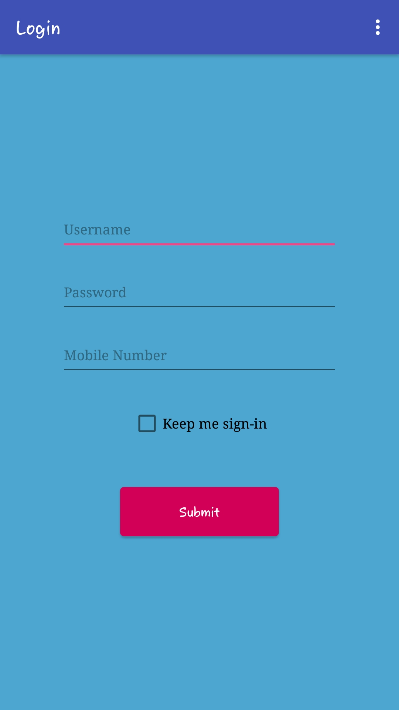
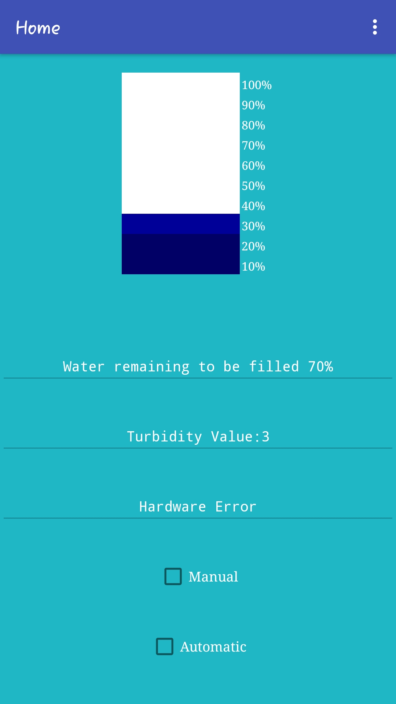
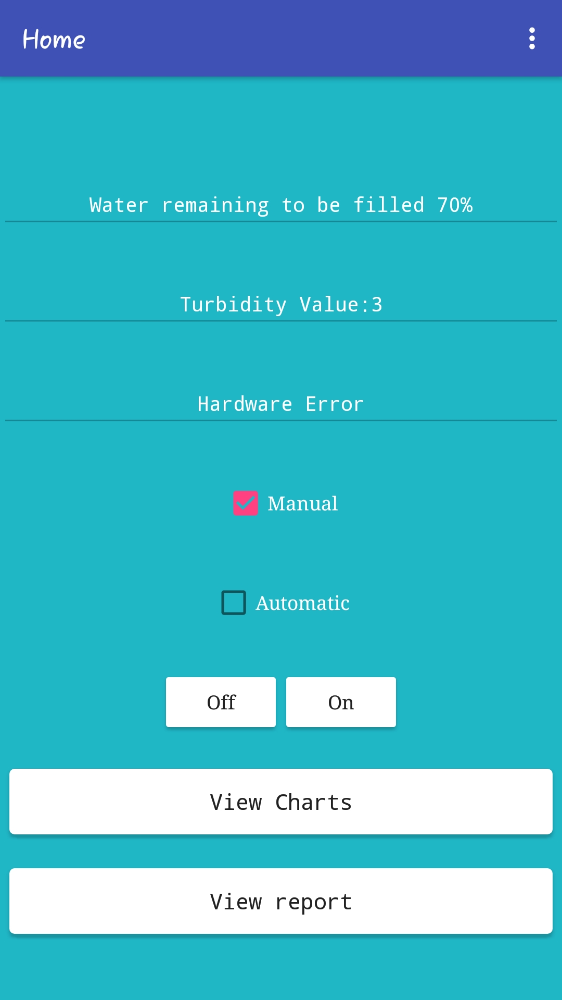
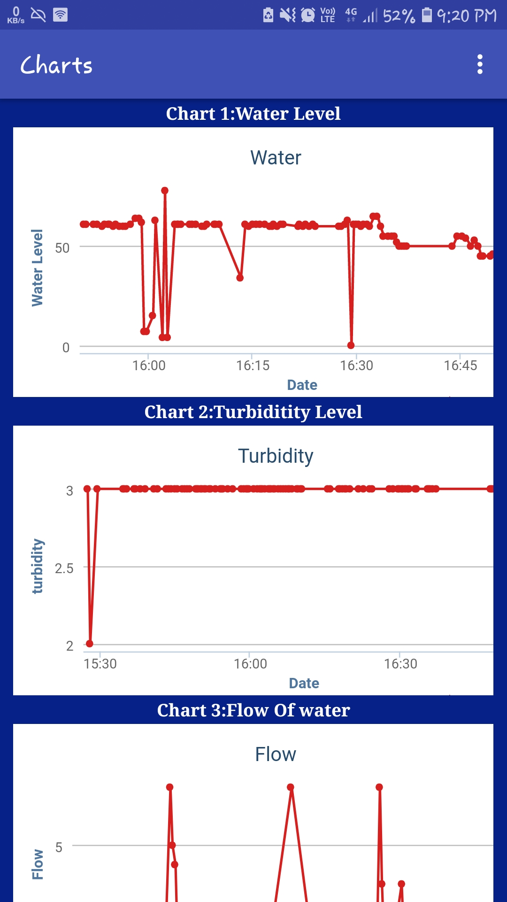

# Water
A water management system build with IOT and Cloud

## Table of contents :mag:
* [General info](#summary-clipboard)
* [Technologies](#technologies-hammer)
* [Features](#features-zap)
* [Screenshots](#screenshots-eyes)

## Summary :clipboard:

The main purpose of the system is to reduce the amount of overflowing of water. 
The objective of the project is to control the water motor manually as well as automatically. 
This system can be used in buildings as well as in industries where the amount of overflowing of water is very high and can be reducible

## Technologies :hammer:
Project is created with:
* [Arduino UNO R3](https://www.arduino.cc/)
* [ThingSpeak](https://thingspeak.com/)
* [MIT App Inventor](https://appinventor.mit.edu/)
	
## Features :zap:
### Following are the defects in already present system and how this sytem will overcome them
* Calculating only water quantity – To overcome this problem proposed system will calculate the water quality information with water quantity information with the help of sensors. 
The water quality information will be measured with the Ph sensor, turbidity sensor and flow sensor.
* Power failure while starting motor – This problem will be resolved with an alert messages to the system owner as there is no power supply to turn on the motor. 
In any case of power failure system will send appropriate alert messages to the system owner.
* No water supply from incoming water lines – This problem will be detected by flow sensor as there will be no flow of water through supplying lines and in such case an alert message about water shortage will be sent to system owner.

### Unique features of this system
* Mobile application
  * The mobile application allows user to view water levels, control motor and view reports!
* Two Modes
  * Manual mode allows user to control water flow to tank through simple on/off buttons.
  * Automatic mode allows system to detect whether water has gone to certain level and then decide whether to start or stop the water intake. 
* Report Generation through MATLAB

## Screenshots :eyes:

<table>
  <tr>
    <th>
        
    </th>
    <th>
        
    </th>
    <th>
        
    </th>
    <th>
        
    </th>
  </tr>
</table>

## Questions & Issues :thinking:

## Contributing :+1:

### Contributors

* [Prathamesh Jadhav](https://github.com/PrathameshJadhav33)
* [Omkar Kajarekar](https://github.com/omkarkajarekar)
* [Bhavya Oswal](https://github.com/BhavyaOswal2908)
* Atharva Joshi

If you found a bug, have an idea how to improve the Contact Diary app or have a question, please create a [new issue](https://github.com/PrathameshJadhav33/Water/issues/new) or comment an existing one. If you would like to contribute code, fork the repository and send a pull request.

## License :page_facing_up:
